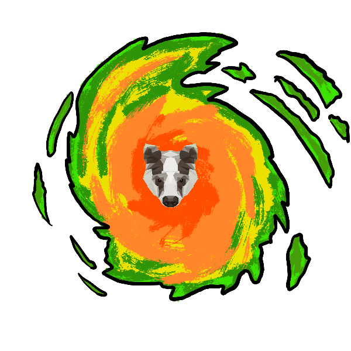
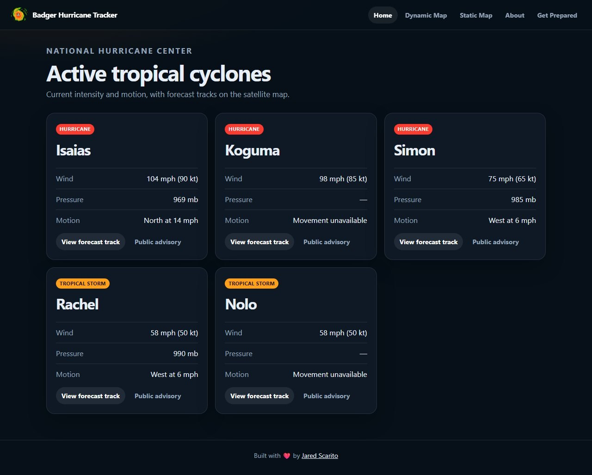
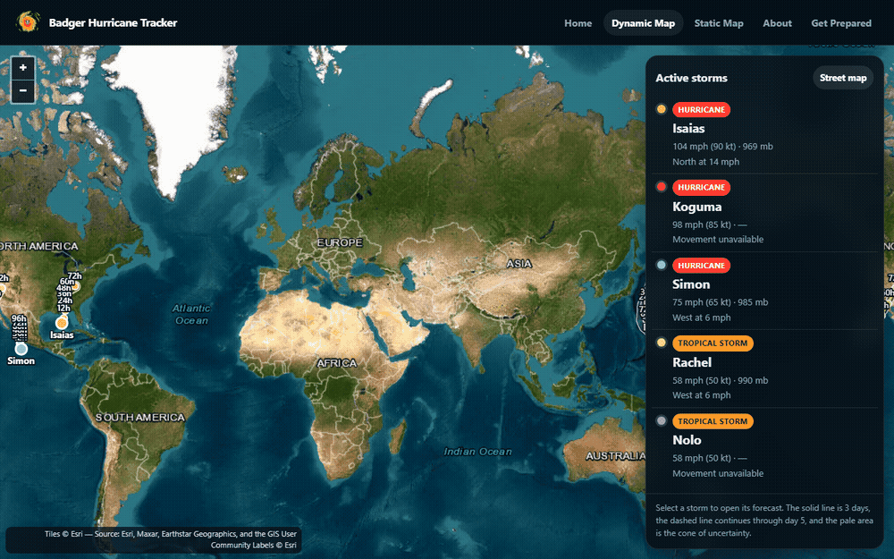
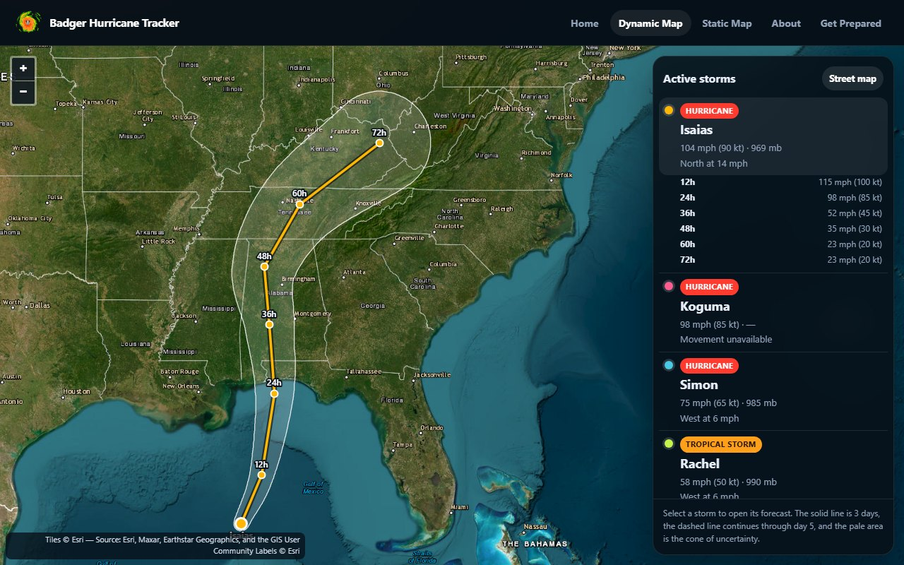
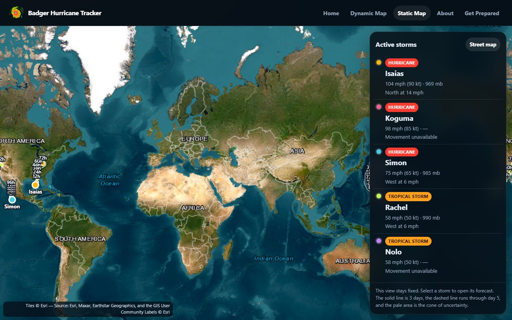
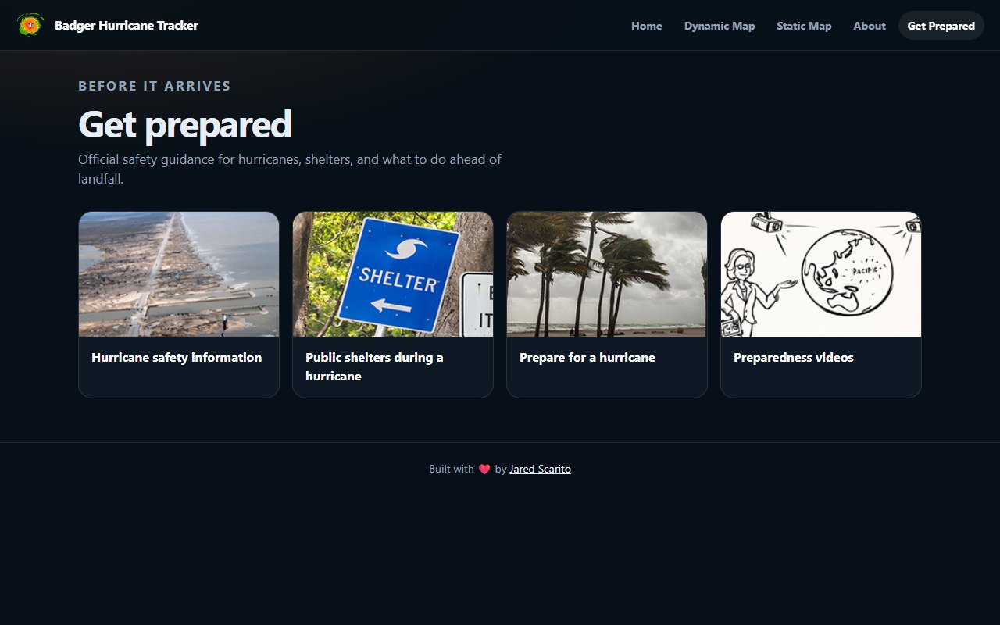

# Badger Hurricane Tracker



A live look at active tropical cyclones: current wind and motion, forecast tracks, and the cone of uncertainty on a satellite map.

**Live site:** https://jaredscar.github.io/BadgerHurricaneTracker/index.html

The storms in the pictures below were on the map when the images were captured. The site itself always follows the latest advisories.

## Active storms

The home page lists every active storm with wind, pressure, and motion. Each card links to that storm’s forecast track.



## Forecast tracks

The dynamic map opens on a satellite view of every active storm. Choose a storm to zoom to its track and open the hour-by-hour forecast. Switch between the satellite view and a street map with the button in the sidebar. The solid line is the 3-day forecast, the dashed line continues through day 5, and the pale area is the cone of uncertainty.





The static map uses the same storms and tracks, without panning or zooming.



## Get prepared

Preparedness links point to official hurricane safety guidance from the National Weather Service and the CDC.



## Run it locally

The pages are static. Storm data is loaded in the browser, so any local file server is enough:

```bash
python -m http.server 8080
```

Then open http://127.0.0.1:8080/index.html.

`python serve.py` serves the same site at that address.

## Where the data comes from

Positions, forecast tracks, and cones come from the [Esri Active Hurricanes](https://services9.arcgis.com/RHVPKKiFTONKtxq3/arcgis/rest/services/Active_Hurricanes_v1/FeatureServer) feature service. That feed is compiled from the [National Hurricane Center](https://www.nhc.noaa.gov/) and the Joint Typhoon Warning Center, and the browser is allowed to read it directly. That is what lets the site work on GitHub Pages without a backend.

## Credits

- [Jared Scarito](https://jaredscarito.com) built the tracker.
- [OpenLayers](https://openlayers.org/) draws the map.
- [Esri](https://www.esri.com/) provides the satellite imagery, place labels, and the active-hurricane feed.
- The National Hurricane Center and the Joint Typhoon Warning Center produce the forecasts.
- Preparedness artwork and guidance come from the National Weather Service and the CDC.
